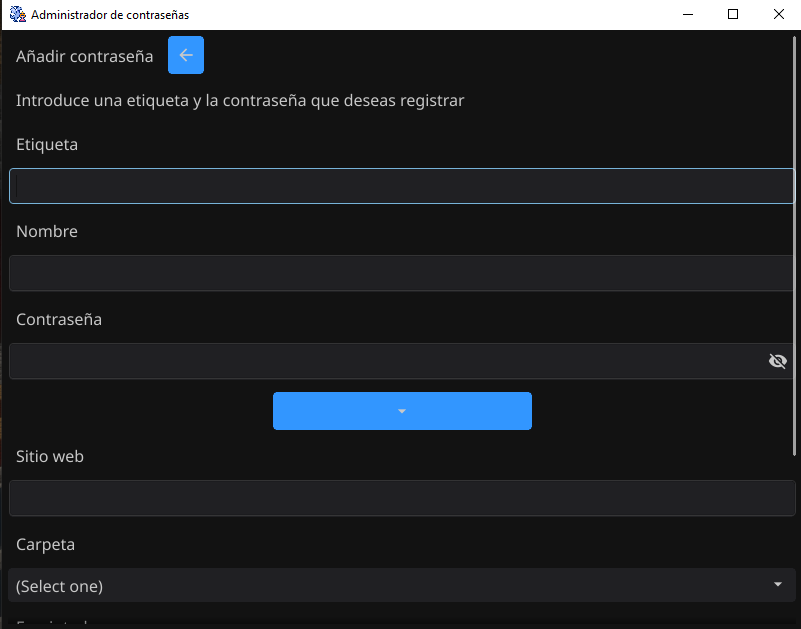

# Gestor de contraseñas en GO

## Objetivo

El principal objetivo de este proyecto es profundizar mis conocimientos en Go, explorando sus librerías y capacidades para el desarrollo de aplicaciones seguras y eficientes. El proyecto también servirá como una pieza clave para mi portafolio profesional, enfocándome en mi futura especialización en seguridad informática.

Además, incluirá características de seguridad como cifrado fuerte, protección de datos sensibles, actualizaciones automáticas, firma digital para integridad del software y distribución multiplataforma. Tendrá una interfaz gráfica de usuario (GUI) para una experiencia más accesible.

## Caso de Uso

**Escenario:**

Un desarrollador maneja múltiples proyectos con distintas plataformas como servicios en la nube y repositorios de código. Para mantener la seguridad, necesita contraseñas complejas para cada servicio. Un día, uno de los servicios sufre una brecha de seguridad y filtran credenciales.

**Solución:**

Un gestor de contraseñas permite generar contraseñas únicas y seguras, evitando el riesgo de reutilización. Con esta herramienta, se mitiga el impacto de brechas de seguridad y se simplifica la gestión de credenciales.

## Descarga

### Binarios
- **Windows amd64:** https://github.com/nicorf12/passwordManager/releases/download/v0.3.3/win_amd64.rar
- **Linux amd64:** https://github.com/nicorf12/passwordManager/releases/download/v0.3.3/lin_amd64.zip

### Instalación

Para instalar el gestor de contraseñas, sigue estos pasos:

1. **Descompresión:**
   Descarga el archivo `.rar` correspondiente y descomprímelo. Dentro encontrarás:
   - El binario ejecutable.
   - La firma digital.
   - Una carpeta `resources`.
   - Una carpeta `localizations`.
   - Un archivo `LICENSE`.
   - Un archivo `README` con las instrucciones de instalación.

2. **Preparación del binario:**
   Una vez descomprimido el archivo, el binario estará listo para utilizarse.

**Nota:** Antes de ejecutar el binario, verifica la firma digital utilizando la clave pública incluida en el `README` dentro del comprimido para asegurar la integridad y autenticidad del software.

### Código fuente
- https://github.com/nicorf12/passwordManager/archive/refs/tags/v0.3.3.zip

Puedes encontrar más información del proyecto en el archivo `README` dentro de la carpeta `docs`.

## Almacenamiento
Para este proyecto, utilizamos SQLite como solución de almacenamiento local. Esta elección se debe a que es un proyecto personal, no dedicado, y no estamos en situación de costear un servidor. SQLite proporciona una base de datos ligera, eficiente y fácil de integrar con nuestra aplicación, permitiendo mantener la simplicidad del desarrollo.

## Sincronización de Contraseñas
Dado que la base de datos es local, la sincronización de contraseñas entre computadoras se realiza mediante un sistema de exportación e importación de archivos encriptados. Esta funcionalidad permite transferir las credenciales de manera segura y sencilla. Los archivos exportados están cifrados, asegurando que solo puedan ser leídos por la aplicación y el usuario autorizado, protegiendo así la privacidad de los datos durante la transferencia.

## Descargo de Responsabilidades

Este proyecto se proporciona "tal cual", sin garantías de ningún tipo, ya sean explícitas o implícitas, incluyendo pero no limitándose a garantías de comerciabilidad, idoneidad para un propósito particular o no infracción. El uso de este gestor de contraseñas es bajo su propio riesgo.

El autor no será responsable de ninguna pérdida de datos, daño a la propiedad o daño incidental o consecuente derivado del uso, mal uso o incapacidad para usar este software, incluso si se ha advertido al autor de la posibilidad de tales daños.

Este gestor de contraseñas tiene como objetivo mejorar la seguridad y facilitar la gestión de contraseñas. Sin embargo, ningún sistema es infalible, y el usuario es responsable de la correcta implementación y uso del software. Se recomienda seguir buenas prácticas de seguridad y mantener el software actualizado.

## Imagenes

**Login** 

**Contraseñas & Temas** 

**Añadir contraseña** 

**Ver contraseña** 

